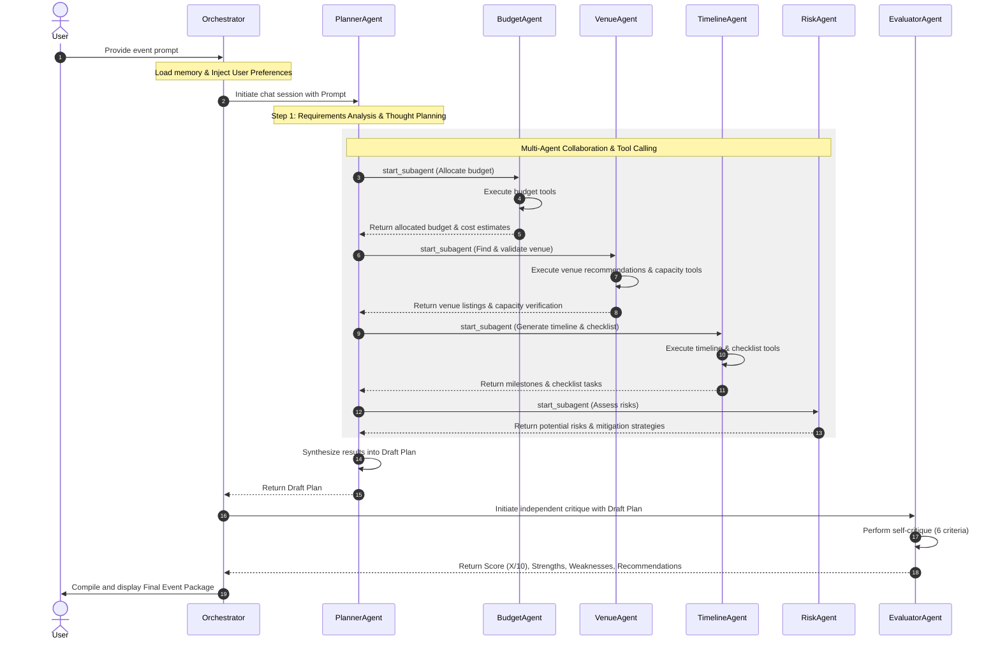
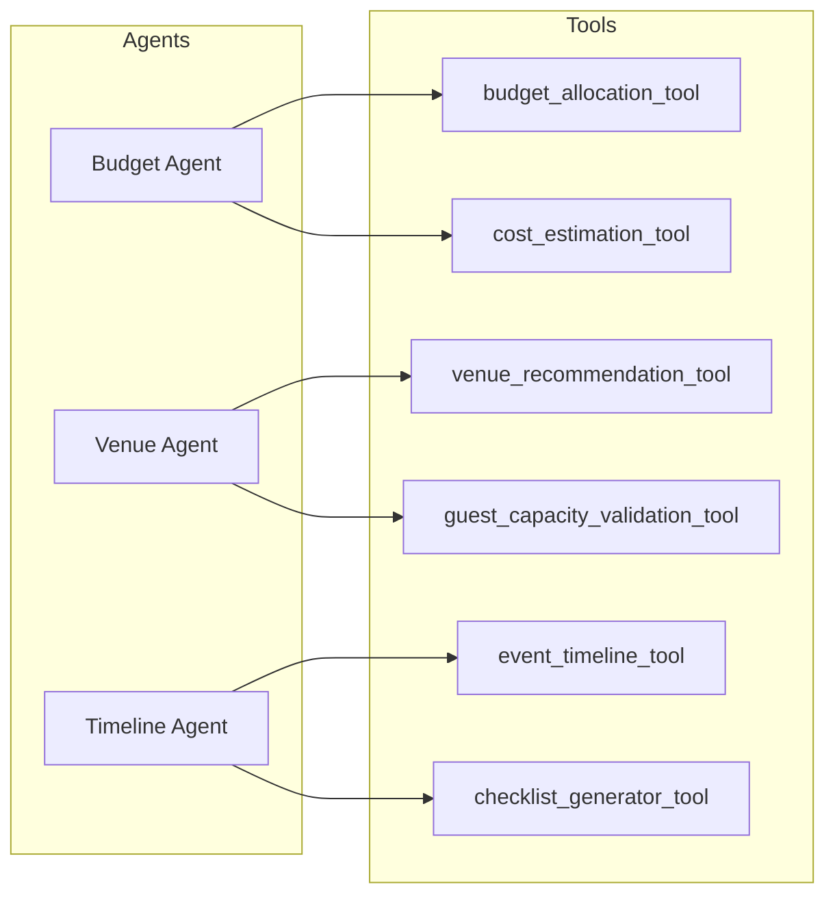
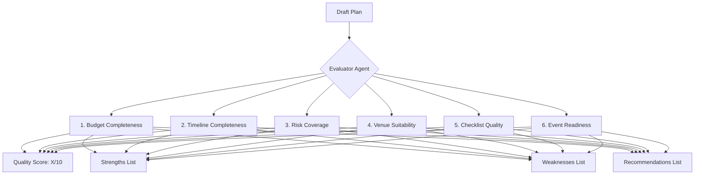

# 📅 Smart Event Planning Copilot

**Smart Event Planning Copilot** is a production-ready, enterprise-grade multi-agent event planning application built with the **Google Antigravity SDK (ADK 2.0)** and powered by **Gemini 2.5 Flash**. 

This system is designed as a **Portfolio Showcase**, **Kaggle Vibe Coding Agents Capstone Project**, and a **Live Demo** demonstrating true agentic AI behavior: planning, delegation, tool usage, persistent memory, and self-critique.

---

## 📐 System Architecture

The following diagrams illustrate the design of our Multi-Agent planning environment.

### 1. Component Diagram
Shows the high-level connection between the User, Orchestrator, Agents, Memory, and Tools.

```mermaid
graph TD
    User([User Prompt]) --> Streamlit[Streamlit Web App]
    User --> Notebook[Jupyter Notebook]
    Streamlit & Notebook --> Orchestrator[Orchestrator Pipeline]
    
    Orchestrator --> MemorySystem[(Memory Manager)]
    MemorySystem --> |Retrieve preferences| Orchestrator
    Orchestrator --> |Inject Memory & Prompt| PlannerAgent[Planner Agent]
    
    subgraph Multi-Agent Collaboration (ADK 2.0)
        PlannerAgent -->|start_subagent| BudgetAgent[Budget Agent]
        PlannerAgent -->|start_subagent| VenueAgent[Venue Agent]
        PlannerAgent -->|start_subagent| TimelineAgent[Timeline Agent]
        PlannerAgent -->|start_subagent| RiskAgent[Risk Assessment Agent]
    end
    
    subgraph Tools Suite
        BudgetAgent -->|calls| ToolBA[Budget Allocation Tool]
        BudgetAgent -->|calls| ToolCE[Cost Estimation Tool]
        VenueAgent -->|calls| ToolVR[Venue Recommendation Tool]
        VenueAgent -->|calls| ToolCV[Capacity Validation Tool]
        TimelineAgent -->|calls| ToolET[Event Timeline Tool]
        TimelineAgent -->|calls| ToolCG[Checklist Generator Tool]
    end

    PlannerAgent -->|Consolidates| DraftPlan[Draft Event Plan]
    DraftPlan -->|Passes to| EvaluatorAgent[Evaluator Agent]
    EvaluatorAgent -->|Self-Critique & Score| EvalReport[Evaluation Report]
    EvalReport -->|Compile| FinalPackage[Final Event Package]
    DraftPlan -->|Compile| FinalPackage
    FinalPackage --> Streamlit & Notebook
```

### 2. Agent Interaction Flow
Illustrates how the Planner Agent analyzes the prompt and orchestrates worker subagents.



### 3. Tool Interaction Flow
Maps which tools are bound to each agent.



### 4. Evaluator Critique Flow
Illustrates the criteria scored by the independent Evaluator Agent.



---

## 🌟 Six Core Agentic AI Concepts Demonstrated

### 1. Multi-Agent Collaboration
Using Google ADK 2.0 patterns, we register static subagents. Worker agents are defined as `types.SubagentConfig` structures bound to the parent `PlannerAgent`. Rather than using simple prompts to simulate subagents, the parent agent programmatically calls the `start_subagent` tool to delegate tasks.

### 2. Tool Usage
Every specialized agent calls real Python tools (defined in [tools.py](file:///Users/spf/Documents/Event%20Manager/copilot/tools.py)). The subagents can call these tools directly and return structural dictionaries to the planner.

### 3. Memory & Context Engineering
We implement local preference persistence via [memory.py](file:///Users/spf/Documents/Event%20Manager/copilot/memory.py). The orchestrator automatically retrieves these preferences and formats them as system instructions at agent startup. The agents can also dynamically call `save_user_preference` during conversation.

### 4. Self-Critique & Evaluation
The [Evaluator Agent](file:///Users/spf/Documents/Event%20Manager/copilot/agents.py) runs in an independent, isolated session to critique the planner's final draft plan. The evaluator grades the plan on completeness, risk coverage, venue fit, and readiness.

### 5. Planning & Reasoning
At start, the Planner analyzes the requirements and outlines its step-by-step workflow (Thought stream), executing in structured phases. The thoughts, tool calls, and subagent handoffs are logged in detail.

### 6. Guardrails & Validation
We implement programmatic checks inside tools (e.g. `guest_capacity_validation_tool` flags a venue as `OVERCAPACITY` and warns if limits are exceeded) and system guardrails inside the Planner's system instructions (e.g. warning if the budget is unrealistic for the guest count).

---

## 🚀 Local Deployment Guide

### Prerequisites
* Python 3.10+
* A valid Gemini API Key from [Google AI Studio](https://aistudio.google.com/app/api-keys)

### Step-by-Step Setup

1. **Clone the Repository** and navigate to the project directory:
   ```bash
   cd "Event Manager"
   ```

2. **Configure Environment Variables**:
   Create a `.env` file from the example:
   ```bash
   cp .env.example .env
   ```
   Open `.env` and fill in your `GEMINI_API_KEY`:
   ```env
   GEMINI_API_KEY=AIzaSy...
   ```

3. **Install Dependencies**:
   ```bash
   pip install -r requirements.txt
   ```

4. **Launch the Streamlit Web Application**:
   ```bash
   streamlit run app.py
   ```
   This opens the dashboard in your default browser at `http://localhost:8501`.

5. **Run the Jupyter Notebook Demo**:
   Ensure you have Jupyter installed and run:
   ```bash
   jupyter notebook smart_event_planner_demo.ipynb
   ```
   Open and execute all cells sequentially to see scenario traces.

---

## ☁️ Cloud Deployment Guide

You can deploy the Streamlit application to **Google Cloud Run** using the `cloudrun` MCP server tools available in this environment.

### 1. Build & Deploy using Google Cloud Run

To build and deploy the application directory directly, you can use the MCP `deploy_local_folder` tool from the `cloudrun` server:

```json
{
  "ServerName": "cloudrun",
  "ToolName": "deploy_local_folder",
  "Arguments": {
    "project_id": "YOUR_GCP_PROJECT_ID",
    "service_name": "smart-event-planning-copilot",
    "folder_path": "/Users/spf/Documents/Event Manager",
    "region": "us-central1"
  }
}
```

Make sure the deployment environment includes:
- `GEMINI_API_KEY` passed as an environment variable or secret.
- The `Dockerfile` below is present in your repository root.

#### Dockerfile Example
If deploying manually to Cloud Run, write a `Dockerfile` at the root:
```dockerfile
FROM python:3.11-slim

WORKDIR /app

COPY requirements.txt .
RUN pip install --no-cache-dir -r requirements.txt

COPY . .

EXPOSE 8501

ENTRYPOINT ["streamlit", "run", "app.py", "--server.port=8501", "--server.address=0.0.0.0"]
```

---

## 🌍 Demonstration Scenarios

The system is tested against the following 4 global scenarios:

1. **Scenario 1 — Birthday Party (Mumbai, India)**: INR 80,000 budget for 50 guests. Shows intimate budget allocation (Venue: 20k, Catering: 35k, Decor: 10k…), tier-appropriate venue options, birthday-specific checklist, and risk assessment for a mid-range indoor venue.

2. **Scenario 2 — Corporate Conference (New York, USA)**: USD 15,000 budget for 200 attendees. Verifies that the system correctly scales budget for large corporate events, produces keynote-ready timeline milestones, and recommends conference centres with AV capabilities.

3. **Scenario 3 — Wedding Reception (London, UK)**: GBP 8,000 budget for 150 guests. Shows multi-category budget breakdown (Venue: £2.4k, Catering: £3k, Florals: £800…), heritage and modern venue recommendations, and wedding-specific checklist including RSVP deadlines and vendor booking windows.

4. **Scenario 4 — Guardrail Validation (Singapore)**: SGD 500 budget for 300 guests. The Planner Agent instantly outputs a budget-insufficiency warning (Cost per guest: SGD 1.67), capacity validation failures, and recommends the user either reduce guest count or increase budget — demonstrating built-in guardrails.
